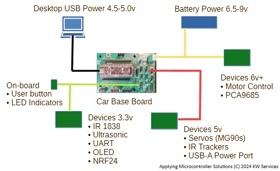

# Car Base Board
A printed circuit board (board) using the BlackPill microcontroller as a base platform for robot car projects.

* Platform: STM32
* Board: STM32F411CEU6 (BlackPill)
* Copyright (C) 2024 KW Services.
* MIT License
* MicroPython 1.20

## Scope.
The Car Base Board is a printed circuit board (PCB) designed for a robot car project that provides a base for 
the BlackPill1
 a USB stick board and headers to external devices. The headers provide a strong and organized 
method to wire connections to external devices (that avoid a rats nest of wires typical in development projects.)
The ports permit the mounting of popular wireless communication devices.

The product is only the PCB. The BlackPill, the devices, wiring and battery are not included. However the 
low-cost BlackPill, wires/cables and many low-cost sensor boards are available from popular retailers.

    <table >
    <tr>
        <td><b>Control</b></td>
        <td><b>Monitor</b></td>
        <td><b>Communicate</b></td>
        <td><b>Display</b></td>
    </tr>
     <tr>
        <td>
        &#x2022; Motor Dual Control 
        &#x2022; PC9685 Sensor (6v servos) 
        &#x2022; (2x) Servos (5v servos) 
        </td>
        <td>
        &#x2022; Ultrasonic (SR-HC04/05) 
        &#x2022; (2x) Slotted optical “Speed” 
        &#x2022; (3x) Infrared Obs. Tracker 
        </td>
        <td>
        &#x2022; Infrared Receiver (IR1838) 
        &#x2022; UART port (Bluetooth) 
        &#x2022; NRF24 port 
        </td>
        <td>
        &#x2022; I2C Port (OLED) 
        </td>
     </tr>
    </table>

This GitHub site includes simple MicroPython examples.

The headers and ports are wired to known I2C, SPI, and UART BlackPill pins. This generic approach allows 
you to choose your preferred sensors and devices. The matching BlackPill male headers provide an easy means
to test BlackPill pins with a Logic Analyzer or even to add connections to sensors and devices on a breadboard.

Additionally, the Car Base Board has a separate connector for power from external batteries. The batteries can 
provide higher voltage and current to the control devices. On the PCB, the battery power is regulated down to 
five-volts. There the five-volt power is fed to several devices during development. Later, the five-volts can 
also be fed to the BlackPill USB Stick board so that now your project board has autonomous operation. [Future YouTube Video]()

### Power Management
For development, there are two sources of power on the board: (1) USB power from a desktop computer 
through the USB-C connector of the BlackPill (thence the BlackPill provides 3.3v power to the PCB), and (2) 
Battery power from an external power source to the Phoenix connector (this provides five-volts to several 
headers via a five volt regulator.) Note: All of the grounds are interconnected on the PCB.

The below diagram depicts the suggested distribution of power across the PCB and devices. The battery 
provides power for the high power (and current draw) devices. This allows every component to be tested even 
while the project is still powered from the desktop. 

Later, one can connect a simple USB power cable to the 
BlackPill from a port on the PCB. In this manner everything is ultimately powered by the batteries alone.

## Hardware Details
The PCB was designed to use “generic” external devices/boards for easier upgrading/replacement.  The layout of the headers and ports was designed to distribute wiring to significantly reduce clutter (no rats nest of wires).  Also the design ensures there is a pathway to get power to all components via batteries.  Finally, the design allows the builder to choose their preferred wireless communication device.

All components (the PCB and optional external devices) are self-contained and accessed via male headers. There should be no need to solder any wire nor drill holes for any parts.  

A kit with components to get you stated is available at Tindie: [click this link](https://www.tindie.com/products/aiy745321/robotcarcomponents-ackermann/)

## Acquiring the Car Base Board.
To learn more, [click this link](https://www.tindie.com/products/aiy745321/car-base-board/) to visit the <B>Applying Microcontroller Solutions</B> store at Tindie.

## Acquiring the <B>BlackPill</B> (STM32F411) from WeAct Studios.
[Link to GitHub web site](https://GitHub.com/WeActStudio/WeActStudio.MiniSTM32F4x1)

1. Make sure you are getting BlackPill (STM32F411) v3.1.
2. You should get the optional 8 MB or 16 MB Flash chip pre-soldered to the bottom of the board.
3. Some retailers will sell the BlackPill board with the headers pre-soldered.
4. Also, from your favorite retailer, I suggest you acquire a "ST LINK-V2" dongle.

A copy of MicoPython firmware (version 1.20) resides on the GitHub site. [Link](https://GitHub.com/kwinter745321/STM32F411BaseBoard/tree/main/Firmware).  

